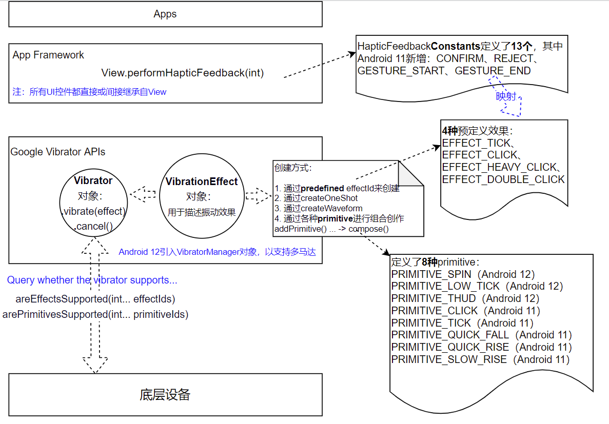

This is a test app with Google Vibrator APIs. You can feel the built-in haptic feedback, which can be invoked from any View. You can test pre-defined effects. You can also use primitives to compose your own vibration effect. See the big picture below. Just for fun you can have a hand massage when you click the 'Massge' button at the bottom of the page.

Official docs: https://developer.android.google.cn/reference/android/os/Vibrator
